# Notes

## TODOs
- [ ] Look into systematising the spatial errors in plot 3 (spatial error heatmap) using error metrics like Moran's I. `plot_error_map`
- [ ] Replicate the Gurobi model (Julia) using an open-source optimisation solver (Python)
    + [ ] Extract the input files to run `select_synpop.jl` and `assign_spatial.jl` independently
    + [ ] Find a working census tract that successfully runs the full pipeline
- [ ] Try to parallelise the process in the Python rewrite as much as possible, given that pop. synthesis for each PUMA is an independent process
- [ ] Low priority. Try to see if you can run the synthpop script on your Linux pc.
- [ ] Create a block diagram of the modules fitting together, see if you can extract the input values to the Gurobi model, to replicate it on a OS Python solver 

## `synthpop.R`
### What it does
- Load libaries
- Set seed
- Assign local R vars to command line argument (when RScript is run from command line)
- Set config i.e. File paths for modules, Julia/R executables, output path. Create output dirs if they do not exist.
- Order of runs (`source`)
    + `prepare_data_file`: `prepare_data.R`
    + `train_bns_file`: `train_bns.R`
    + `sample_hhs_file`: `sample_hhs.R`
    + `sample_indvs_file`: `sample_indvs.R`
    + Run command line command: (`select_synpop_cmd`)
    + Run command line command: (`assign_spatial_cmd`) <- this is where the Julia file is called

Would it help to gather all the files in the Julia file then replicate it in a Python version.

### Variables to note
- `select_synpop_cmd`
```
"\"C:/Users/nicho/AppData/Local/Microsoft/WindowsApps/julia.exe\" \"select_synpop.jl\" 0603700 synthpop_output/0603700/hh_pool_0603700.csv synthpop_output/0603700/indv_pool_0603700.csv synthpop_output/0603700/syn_hhs_0603700.csv synthpop_output/0603700/syn_indvs_0603700.csv synthpop_data/2010_Census_Tract_to_2010_PUMA.csv synthpop_data/acs_marginals/0603700/ synthpop_gurobi_log.txt \"C:\\gurobi1302\\win64\" ./gurobi.lic"
```

- `assign_spatial_cmd`
```
"\"C:/Users/nicho/AppData/Local/Microsoft/WindowsApps/julia.exe\" \"assign_spatial.jl\" 0603700 synthpop_output/0603700/syn_hhs_0603700.csv synthpop_output/0603700/syn_hhs_spatial_0603700.csv synthpop_output/0603700/syn_indvs_0603700.csv synthpop_output/0603700/syn_indvs_spatial_0603700.csv synthpop_data/2010_Census_Tract_to_2010_PUMA.csv synthpop_data/acs_marginals/0603700/ synthpop_gurobi_log.txt \"C:\\gurobi1302\\win64\" ./gurobi.lic"
```

### Generic Notes
- Modules are assign variable names
- Julia modules
    + select_synpop_file <- "select_synpop.jl"
    + assign_spatial_file <- "assign_spatial.jl"

## `plot_maps.R`

### `plot_error_map`
- `puma_labels`: Stores the plot names for 15 of the puma codes + state of WY, and their population densities.

- `sf_geos.puma` <- Calls the function `get_error_map_data`, which calls `get_rmses`. Get the map data based on the map_pumas, since I only added Suffolk County, MA, it only gave me the geometries of all in that county. Smallest spatial resolution is the census tract level.

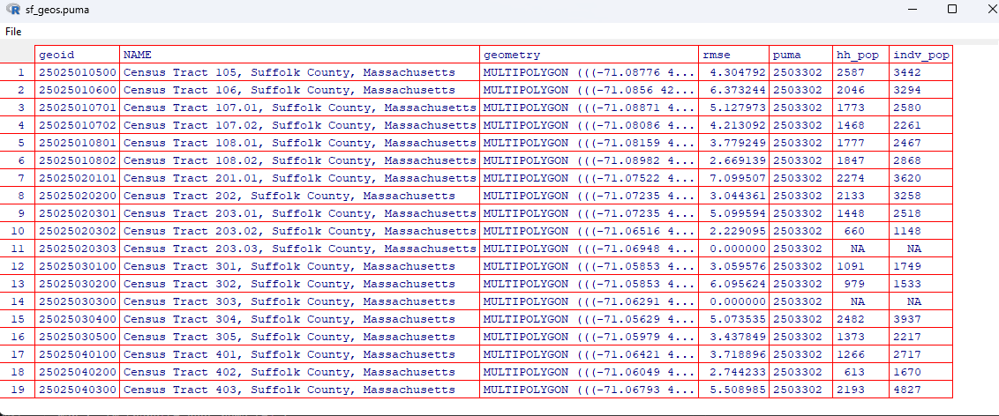

- The marg_ct (marginal counts) are taken from the `error_heatmap()` function,

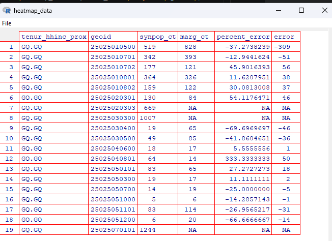

Each census tract level contains a `hh_pop` and a `indv_pop` column, with pop count inside that cell.

- There is a step to remove empty geometries as a safety net.

- `sf_geos.puma.sf`: Applies `st_sf` to the `sf_geos.puma` df. `st_sf` coerces the dataframe into a `sf` object, which is a standard object in R to store spatial vector data.

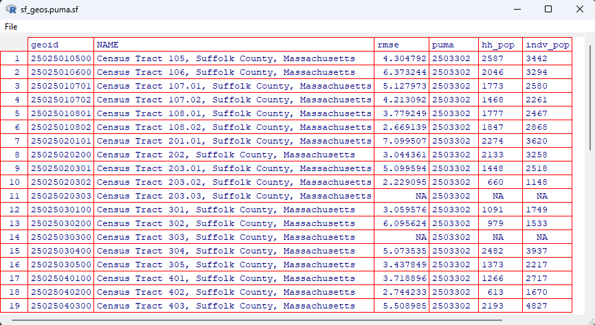

- For more detailed analysis of how the bulk of the data gets processed, look into `get_error_map_data()`


# `get_error_map_data()`

Args
- `variable`: "tenur_hhinc"
- `spatial_level`: "tract"

**Steps:** (Using census tract 2503302 as an example)
- Process synopop files
- Read these two files (replace the census code with something else, note that there is a synpop_suffix for distinguishing runs)
    + `syn_hhs_file`: "synthpop_output/2503302/syn_hhs_spatial_2503302-20220127.csv"
    + `syn_indvs_file`: "synthpop_output/2503302/syn_indvs_spatial_2503302-20220127.csv"
    + Remark: `synpop_suffix`: "20220127"
- Load and preprocess synpop and marginal dataframes
    + `syn_hhs`
    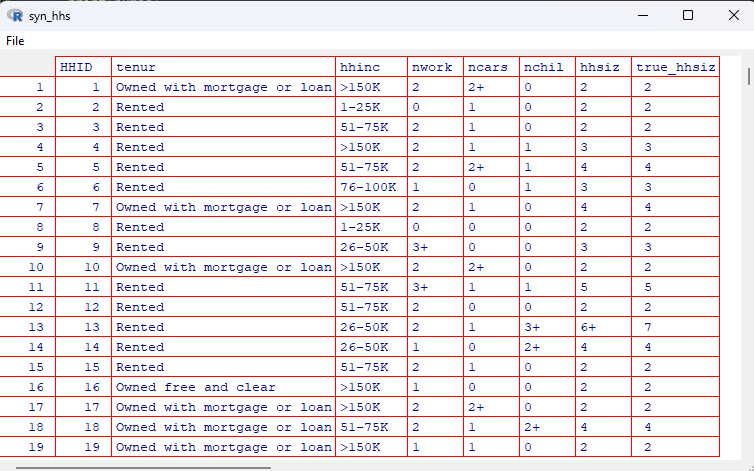
    + `syn_indvs`
    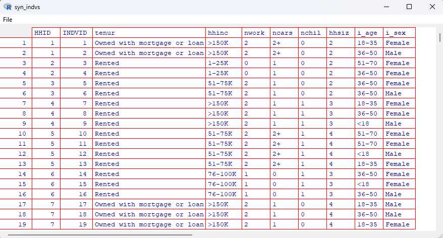

    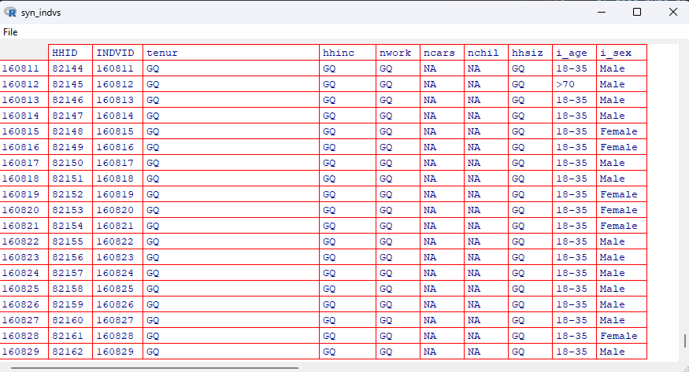

- Process marginal files
- `marg_dir`: "synthpop_data/acs_marginals/2503302/"
- `margs`: List of 8 postprocessed marginal dataframes
    1. `tract_tenur_hhinc.1`

        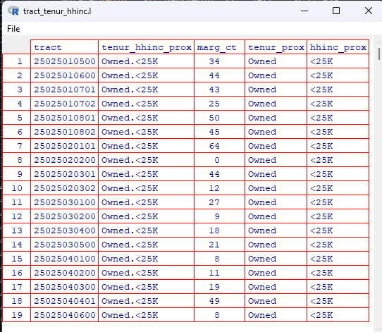

    2. `blkgp_tenur_hhsiz.1`

        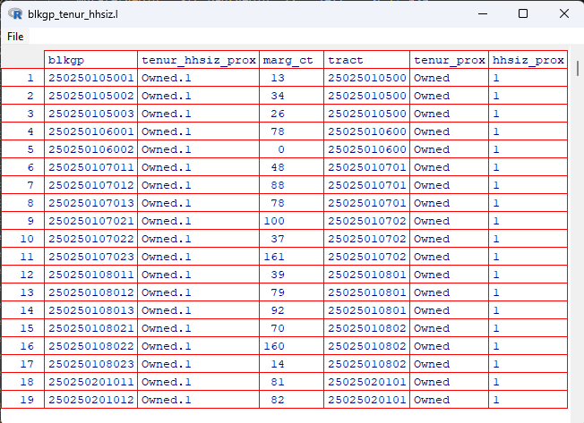

    3. `tract_nwork.1`

        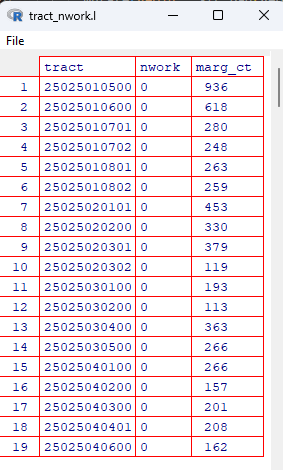

    4. `tract_hhtype.1`

        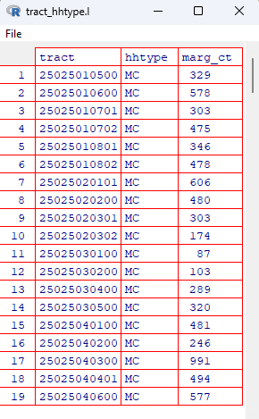

    5. `tract_nwork_ncars.1`

        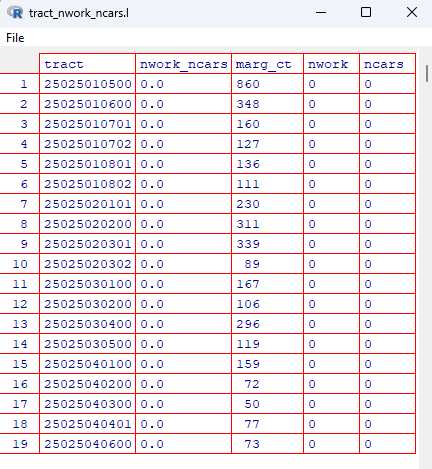

    6. `tract_i_sex_i_age.1`

        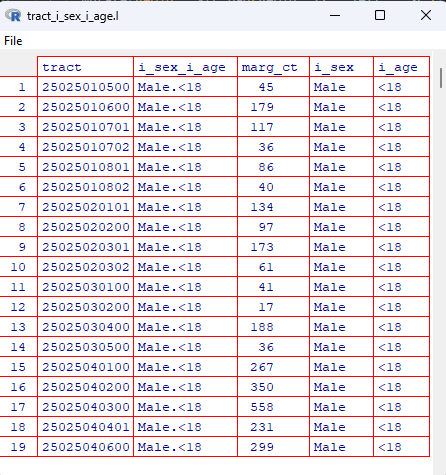

    7. `blkgp_emply.1`

        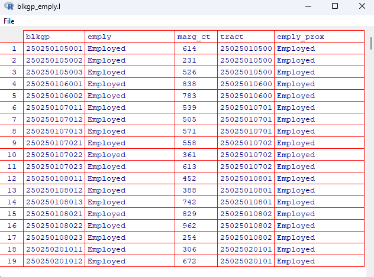

    8. `tract_i_inc.1`

        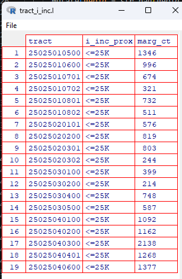
    
- Assign the marg name variable, `marg_name`: "tract_tenur_hhinc.l"
- Assign `sym_variable`: "tenur_hhinc_prox"
- Assign `heatmap_data`, which calls `error_heatmap`:
    + `error_heatmap()` > `pop`

        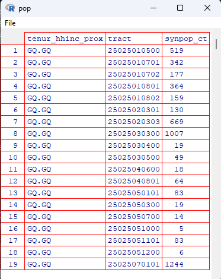
    + `error_heatmap()` > `marg`

        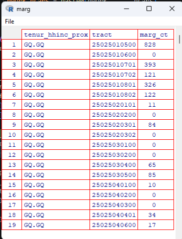

    + `error_heatmap()` > `heatmap_data`

        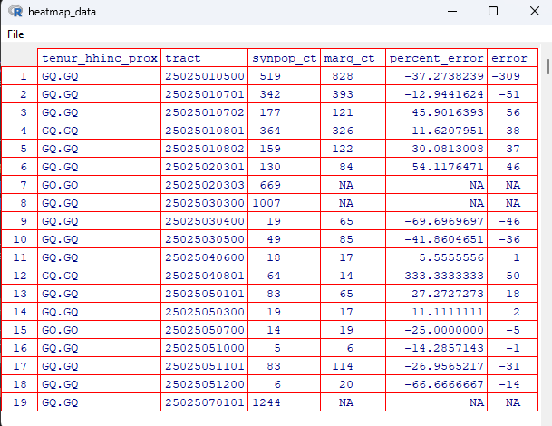

    + 

- Assign sf_geo data for plotting map data, data taken from `map_data/geos/[YOUR_PUMA_NUMBER]_[YOUR_SPATIAL_LEVEL]_geps.Rds` 
- Remark: `.Rds` files are like Python `.pkl` files
- `hh_marg_target`: "tract_hhtype.l"
- `hh_pops`: Count of households from the marginal files

    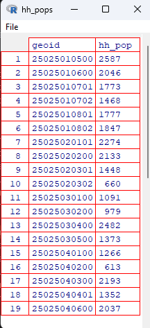

- `indv_marg_target`: "tract_i_sex_i_age.l"
- `indv_pops`: Count of individuals from the marginal files

    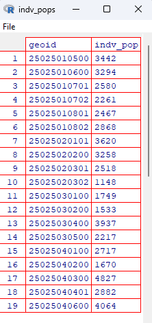

- `sf_geos`: Left join of sf_geos and hh_pops
- `sf_geos.puma`: Row bind of puma `sf_geos.puma` and `sf_geos`.
- Remark: ^ Strangely dataviewer shows only `geoid` and `NAME` cols for both `sf_geos` and `sf_geos.puma`.


