# Notes

## TODOs
- [X] Look into systematising the spatial errors in plot 3 (spatial error heatmap) using error metrics like Moran's I. `plot_error_map`
- [ ] Replicate the Gurobi model (Julia) using an open-source optimisation solver (Python)
    + [ ] Extract the input files to run `select_synpop.jl` and `assign_spatial.jl` independently
    + [ ] Find a working census tract that successfully runs the full pipeline
- [ ] Try to parallelise the process in the Python rewrite as much as possible, given that pop. synthesis for each PUMA is an independent process
- [ ] Low priority. Try to see if you can run the synthpop script on your Linux pc.
- [ ] Create a block diagram of the modules fitting together, see if you can extract the input values to the Gurobi model, to replicate it on a OS Python solver 

## `synthpop.R`
### What it does
- Load libaries
- Set seed
- Assign local R vars to command line argument (when RScript is run from command line)
- Set config i.e. File paths for modules, Julia/R executables, output path. Create output dirs if they do not exist.
- Order of runs (`source`)
    + `prepare_data_file`: `prepare_data.R`
    + `train_bns_file`: `train_bns.R`
    + `sample_hhs_file`: `sample_hhs.R`
    + `sample_indvs_file`: `sample_indvs.R`
    + Run command line command: (`select_synpop_cmd`)
    + Run command line command: (`assign_spatial_cmd`) <- this is where the Julia file is called

Would it help to gather all the files in the Julia file then replicate it in a Python version.

### Variables to note
- `select_synpop_cmd`
```
"\"C:/Users/nicho/AppData/Local/Microsoft/WindowsApps/julia.exe\" \"select_synpop.jl\" 0603700 synthpop_output/0603700/hh_pool_0603700.csv synthpop_output/0603700/indv_pool_0603700.csv synthpop_output/0603700/syn_hhs_0603700.csv synthpop_output/0603700/syn_indvs_0603700.csv synthpop_data/2010_Census_Tract_to_2010_PUMA.csv synthpop_data/acs_marginals/0603700/ synthpop_gurobi_log.txt \"C:\\gurobi1302\\win64\" ./gurobi.lic"
```

- `assign_spatial_cmd`
```
"\"C:/Users/nicho/AppData/Local/Microsoft/WindowsApps/julia.exe\" \"assign_spatial.jl\" 0603700 synthpop_output/0603700/syn_hhs_0603700.csv synthpop_output/0603700/syn_hhs_spatial_0603700.csv synthpop_output/0603700/syn_indvs_0603700.csv synthpop_output/0603700/syn_indvs_spatial_0603700.csv synthpop_data/2010_Census_Tract_to_2010_PUMA.csv synthpop_data/acs_marginals/0603700/ synthpop_gurobi_log.txt \"C:\\gurobi1302\\win64\" ./gurobi.lic"
```

### Generic Notes
- Modules are assign variable names
- Julia modules
    + select_synpop_file <- "select_synpop.jl"
    + assign_spatial_file <- "assign_spatial.jl"

## `plot_maps.R`

### `plot_error_map`
- `puma_labels`: Stores the plot names for 15 of the puma codes + state of WY, and their population densities.

- `sf_geos.puma` <- Calls the function `get_error_map_data`, which calls `get_rmses`. Get the map data based on the map_pumas, since I only added Suffolk County, MA, it only gave me the geometries of all in that county. Smallest spatial resolution is the census tract level.


- The marg_ct (marginal counts) are taken from the `error_heatmap()` function,


Each census tract level contains a `hh_pop` and a `indv_pop` column, with pop count inside that cell.

- There is a step to remove empty geometries as a safety net.

- `sf_geos.puma.sf`: Applies `st_sf` to the `sf_geos.puma` df. `st_sf` coerces the dataframe into a `sf` object, which is a standard object in R to store spatial vector data.


- For more detailed analysis of how the bulk of the data gets processed, look into `get_error_map_data()`


# `get_error_map_data()`

Args
- `variable`: "tenur_hhinc"
- `spatial_level`: "tract"

**Steps:** (Using census tract 2503302 as an example)
- Process synopop files
- Read these two files (replace the census code with something else, note that there is a synpop_suffix for distinguishing runs)
    + `syn_hhs_file`: "synthpop_output/2503302/syn_hhs_spatial_2503302-20220127.csv"
    + `syn_indvs_file`: "synthpop_output/2503302/syn_indvs_spatial_2503302-20220127.csv"
    + Remark: `synpop_suffix`: "20220127"
- Load and preprocess synpop and marginal dataframes
    + `syn_hhs`
    
    + `syn_indvs`
    

    

- Process marginal files
- `marg_dir`: "synthpop_data/acs_marginals/2503302/"
- `margs`: List of 8 postprocessed marginal dataframes
    1. `tract_tenur_hhinc.1`

        

    2. `blkgp_tenur_hhsiz.1`

        

    3. `tract_nwork.1`

        

    4. `tract_hhtype.1`

        

    5. `tract_nwork_ncars.1`

        

    6. `tract_i_sex_i_age.1`

        

    7. `blkgp_emply.1`

        

    8. `tract_i_inc.1`

        
    
- Assign the marg name variable, `marg_name`: "tract_tenur_hhinc.l"
- Assign `sym_variable`: "tenur_hhinc_prox"
- Assign `heatmap_data`, which calls `error_heatmap`:
    + `error_heatmap()` > `pop`

        
    + `error_heatmap()` > `marg`

        

    + `error_heatmap()` > `heatmap_data`

        

    + 

- Assign sf_geo data for plotting map data, data taken from `map_data/geos/[YOUR_PUMA_NUMBER]_[YOUR_SPATIAL_LEVEL]_geps.Rds` 
- Remark: `.Rds` files are like Python `.pkl` files
- `hh_marg_target`: "tract_hhtype.l"
- `hh_pops`: Count of households from the marginal files

    

- `indv_marg_target`: "tract_i_sex_i_age.l"
- `indv_pops`: Count of individuals from the marginal files

    

- `sf_geos`: Left join of sf_geos and hh_pops
- `sf_geos.puma`: Row bind of puma `sf_geos.puma` and `sf_geos`.
- Remark: ^ Strangely dataviewer shows only `geoid` and `NAME` cols for both `sf_geos` and `sf_geos.puma`.


# Moran's I

Constants/Parameters Defined
- **Spatial resolution of polygons** (i.e. Singapore's case: Region > Planning Area > Subzone)
- **Neighbour definition** (how polygons define their neighbours? Contiguous, Distance, Non-spatial? Rook, Queen?)
- **Spatial weight matrix, $w$**
    + (all weights of each polygon's list of neighbours must sum to 1, can reweigh if you have special insight i.e. pop density?) <- Apparently I is quite sensitive to the weights.

**Reference**: https://mgimond.github.io/simple_moransI_example/

**What you'll need**
- R Libraries 
    + `sf`: To manipulate spatial data
    + `spdep`: To calculate Moran's I with hypothesis testing
    + `tmap`: For plotting map visualisations
- sf object (Like a geodataframe) with
    + Spatial attributes
    + Regular attributes (i.e. Age, Income, Housing Age etc)

**Pre-Moran's I Analysis Check**
- Take note of outliers, which might mess with your hypothesis testing
- Paraphrased from Gimond:
    > Moran's I is becomes less useful if there are outliers / if the data is heavily skewed. So it's good practice to check for the distribution of the data at the start.
- Methods to check for outliers (visual inspection)
    + Histogram
    + Boxplot

```R
# Histogram
hist(s$Income, main=NULL)
# Boxplot
boxplot(s$Income, horizontal=FALSE)
```

**Moran's I Analysis** 
1. Define neighbouring polygons
    + Neighbour definitions
        + Contiguous polygons (polygons adjacent to one another, no gaps)
        + Polygons within a certain distance threshold
            - Queen Case: If your polygon's vertex touches my (current position's) polygon, we're neighbours
            - Rook Case: Your polygon needs to share a border (not just vertex) with my (current position's) polygon, to be defined as neighbours.
        + Non-spatial definition, i.e. social, political, cultural neighbours.

```R
# `poly2nb` comes from the spdep package
nb <- poly2nb(s, queen=TRUE)
# The polygon ids that are 'neighbours' of polygon id 1
# In this case, each polygon is one county
nb[1]
```
- ^ Creates a list, each element in the list is one row of your spatial dataframe (a polygon).
- Each element contains the list of neighbours

2. Assign weights to the each polygon's neighbours.

Size of weight matrix, $w$, is a square matrix, but it will have zeroes in in $w_{ij}$ where polygon $i$ is not neighbours with polygon $j$.

From the [Moran's I Wikipedia page](https://en.wikipedia.org/wiki/Moran%27s_I):
> The idea is to construct a matrix that accurately reflects your assumptions about the particular spatial phenomenon in question. A common approach is to give a weight of 1 if two zones are neighbors, and 0 otherwise, though the definition of 'neighbors' can vary. Another common approach might be to give a weight of 1 to k nearest neighbors, 0 otherwise. An alternative is to use a distance decay function for assigning weights. Sometimes the length of a shared edge is used for assigning different weights to neighbors. The selection of spatial weights matrix should be guided by theory about the phenomenon in question. The value of is quite sensitive to the weights and can influence the conclusions you make about a phenomenon, especially when using distances.

You can use equal weights as in:

```
0.2(neighbor1) + 0.2(neighbor2) + 0.2(neighbor3) + 0.2(neighbor4) + 0.2(neighbor5)
```

```R
# Using the nb2listw from the spdep
# `lw` has type `listw` object
lw <- nb2listw(nb, style="W", zero.policy=TRUE)
```

- Documentation for `nb2listw`
```R
nb2listw(neighbours, glist=NULL, style="W", zero.policy=NULL)
listw2U(listw)
```
- **neighbours**
    
    an object of class nb

- **glist**

    list of general weights corresponding to neighbours

- **style**

    style can take values “W”, “B”, “C”, “U”, “minmax” and “S”

    + "W": Row standardised, sums over all neighbours to 1
    + "B": Basic binary coding
    + "C" Globally standardised (all pairs sum to n)
    + "U": "C" divided by number of neighbours 
    + "S": Variance-stabalizing coding scheme proposed by Tiefelsdorf et al. 1999, p. 167-168 

- **zero.policy**

    default NULL, use global option value; if FALSE stop with error for any empty neighbour sets, if TRUE permit the weights list to be formed with zero-length weights vectors

- **listw**
    
    a listw object created for example by nb2listw


3. (Optional) Compuate the weighted target attribute you are testing for
- Computed the (weighted) neighbour mean income values
- Note from Gimond: 
  > NOTE: This step does not need to be performed when running the moran or moran.test functions outlined in Steps 4 and 5. This step is only needed if you wish to generate a scatter plot between the income values and their lagged counterpart.

4. Compute Moran's I statistics
$$I = \frac{n}{\sum_{i=1}^{n}\sum_{j=1}^{n}w_{ij}}
\frac{\sum_{i=1}^{n}\sum_{j=1}^{n}w_{ij}(x_i-\bar{x})(x_j-\bar{x})}{\sum_{i=1}^{n}(x_i - \bar{x})^2}$$

```R
# Using the `moran()` function from the `spdep` package
I <- moran(s$Income, lw, length(nb), Szero(lw))[1]

# x - s$Income
# lw - listw
# n - length(nb)
# S0 - Szero(lw) <- If there are 67 regions and if all sum to 1 then S0 = 67
```

```R
# From the documentation
moran(x, listw, n, S0, zero.policy=attr(listw, "zero.policy"), NAOK=FALSE)
```

- **x**

    a numeric vector the same length as the neighbours list in listw

- **listw**

    a listw object created for example by nb2listw

- **n**

    number of zones

- **S0**

    global sum of weights

- **zero.policy**

    default attr(listw, "zero.policy") as set when listw was created, if attribute not set, use global option value; if TRUE assign zero to the lagged value of zones without neighbours, if FALSE assign NA

- **NAOK**

    if 'TRUE' then any 'NA' or 'NaN' or 'Inf' values in x are passed on to the foreign function. If 'FALSE', the presence of 'NA' or 'NaN' or 'Inf' values is regarded as an error.

5. Performing a hypothesis test

    i.e. 

    - $H_0$ : “the income values are randomly distributed across counties following a completely random process”
    - $H_1$ : "There is a spatial element to the distribution of mean income in the counties"
    - Two methods to perform hypothesis test
        + Analytical method
        + Monte Carlo method

    5.1 Analytical method
    - Use the `moran.test` function; one-sided hypothesis test.
    - Recall that the motivations for one vs. two sided test
    + One-sided: An increase or decrease (single directional change)
    + Two-sided: A change in either direction (bidirectional change)
    ```R
    moran.test(s$Income,lw, alternative="greater")
    ```
    - ^ Output log states that the p-value is close to 0.
    - Documentation for `moran.test`
    ```R
    moran.test(x, listw, randomisation=TRUE, zero.policy=attr(listw, "zero.policy"),
            alternative="greater", rank = FALSE, na.action=na.fail, spChk=NULL,
            adjust.n=TRUE, drop.EI2=FALSE)
    ```
    - The `alternative` parameter can take the following arguments
    + `greater`, $\mu > x$
    + `less`, $\mu < x$
    + `two.sided` $\mu \neq x$

    ```R
    # First arg: Attribute you want to test for
    # Second arg: List of weights
    # Alternative: greater, lesser, two.sided hypothesis test
    moran.test(s$Income, lw, alternative="two.sided")
    ```

    5.2 Monte Carlo Method
    - Analytical approach to Moran's I may be sensitive to irregularly distributed polygons.
    - Use the `moran.mc(n)` function to run an MC simulation, where `n` is the number of simulations.
    ```R
    MC<- moran.mc(s$Income, lw, nsim=999, alternative="greater")

    # View results (including p-value)
    MC
    ```

    ```R
    # Plot the Null distribution (note that this is a density plot instead of a histogram)
    # ^ to help visualise the distribution of Moran's I values had
    # incomes been randomly distributed.
    # The black line shows our observed statistic falls way right of the
    # distribution => income values are clustered
    plot(MC)
    ```

    Gimond suggests another way to visualise (on a map) how a typical your patterns are
    is to compare randomly distributed patterns side-by-side from your observed spatial distribution
    of your demographic attribute (or whatever attribute you're interested in)

# `assign_spatial.jl`
- Assign command line arguments to Julia variables
```Julia
"\"C:/Users/nicho/AppData/Local/Microsoft/WindowsApps/julia.exe\" \"assign_spatial.jl\" 2503302 synthpop_output/2503302/syn_hhs_0603700.csv synthpop_output/2503302/syn_hhs_spatial_0603700.csv synthpop_output/2503302/syn_indvs_0603700.csv synthpop_output/2503302/syn_indvs_spatial_0603700.csv synthpop_data/2010_Census_Tract_to_2010_PUMA.csv synthpop_data/acs_marginals/2503302/ synthpop_gurobi_log.txt \"C:\\gurobi1302\\win64\" ./gurobi.lic"
```

| Constant                               | Example                                               |
|:---------------------------------------|:------------------------------------------------------|
| const CURR_PUMA = ARGS[1]              | 2503302                                               |
| const SYN_HHS_FILE = ARGS[2]           | synthpop_output/2503302/syn_hhs_0603700.csv           |
| const SYN_HHS_SPATIAL_FILE = ARGS[3]   | synthpop_output/2503302/syn_hhs_spatial_0603700.csv   |
| const SYN_INDVS_FILE = ARGS[4]         | synthpop_output/2503302/syn_indvs_0603700.csv         |
| const SYN_INDVS_SPATIAL_FILE = ARGS[5] | synthpop_output/2503302/syn_indvs_spatial_0603700.csv |
| const PUMA_TRACT_EQUIV_FILE = ARGS[6]  | synthpop_data/2010_Census_Tract_to_2010_PUMA.csv      |
| const MARG_DIR = ARGS[7]               | synthpop_data/acs_marginals/2503302/                  |
| const GUROBI_LOGFILE = ARGS[8]         | synthpop_gurobi_log.txt                               |
| ENV["GUROBI_HOME"] = ARGS[9]           | \"C:\\gurobi1302\\win64\"                             |
| ENV["GRB_LICENSE_FILE"] = ARGS[10]     | ./gurobi.lic                                          |

- Remark: Const `const num = 2`-> Type is fixed and variable cannot be reassigned unlike normal assignment `num = 2`

- Variables I need to save to file
    + `puma_tract_equiv`

        Description: A map for matching 'Tract ID' to 'PUMA ID'? Contains
        all the PUMAs IDs, duplicated state and county codes.

        `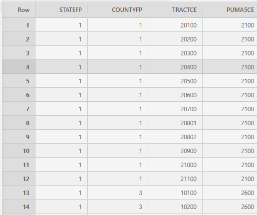

    + `curr_geo`

        Description: Contains the geoid data for the geographic area under consideration (i.e Suffolk County, MA only for our example, state id: 25, county id: 25)

        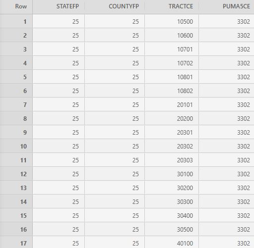

        - Image above shows post-filtering
        - `curr_geo` is a filtered version of `puma_tract_equiv`, filter is the 
        STATEFP == CURR_PUMA[1:2] and PUMA5CE == CURR_PUMA[3:7]
        - In our example, 2503302, that's 
            + `STATEFP = 25`
            + `CURR_PUMA = 03302` (I guess the leading zero gets dropped)
    + `TRACT_GEOIDS`

        Description: Master reference dataframe for all the tract (lowest-spatial) resolution IDs. Created from manipulating `curr_geo`, gluing the column values together to form a single column tract ID (called `1` for some reason) columm in `TRACT_GEOIDS`.

        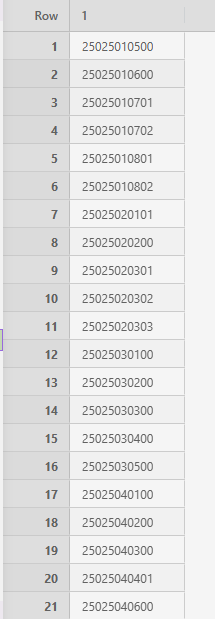

        + Manipulates `curr_geo` above, to glue the state, county and tract id into one
        string, with the necessary "0" padding
        + i.e. First row of `curr_geo`
            - STATEFP: 25
            - COUNTYFP: 25
            - TRACTCE: 10500
        + First row of `TRACT_GEOIDS`, after gluing, leading zero added for COUNTYFP, TRACTCE
            - 25025010500

    + `blkgp_marg_df` (Note: It undergoes one transform in line 33)

        Description: The blockgroup marginals dataframe, which goes through several
        dataframe transforms.

        + Raw version

            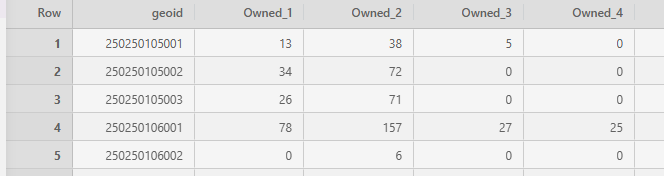

        + Transformed version

            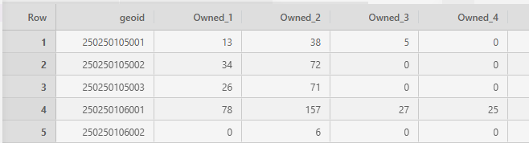

        Looks the same because MA's state code is `25`, (double digit), but if you use `06` then you have to left pad with 0. 

    + `BLKGP_GEOIDS`

        Description: The `GEOIDs` column of `blkgp_marg_df` with the right zero-padding applied.

        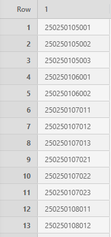

    + `tract_blkgp`

        Description: The index pointers, pointing to `BLKGP_GEOIDS`, for each row of `TRACT_GEOIDS`.

        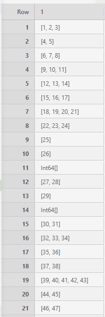

        + i.e. `BLKGP_GEOIDS`'s row 1,2,3's first 11 characters (drop last digit) match the first row of `TRACT_GEOIDS`

    + `indv_index`

        `5`

        Description: Sum of files (listed below) plus 1: 4 + 1 = 5

        ```Julia
        const BLKGP_MARG_FILES = ["blkgp_tenur_hhsiz.csv"]
        const TRACT_MARG_FILES = ["tract_hhtype.csv", "tract_tenur_hhinc.csv", "tract_nwork.csv"]
        ```

    + `m`

        `94`
        
        Description: The number of rows in `BLKGP_GEOIDS`


    + `MARG_FILES`

        Description: A `6-element Vector{String}` of the filenames for all the marginal dataframes.
        
        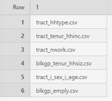

        1. "tract_hhtype.csv"
        2. "tract_tenur_hhinc.csv"
        3. "tract_nwork.csv"
        4. "blkgp_tenur_hhsiz.csv"
        5. "tract_i_sex_i_age.csv"
        6. "blkgp_emply.csv"

    + `marginals`
        
        Description:
        - 6-element vector, one vector contains an array ver of the .csv dataframes
        - i.e. The first element vector is `tract_hhtype.csv`, then
        `marginals[1]` is the array version of the dataframe below

        _Original `tract_hhtype.csv`, now the first element of `marginals`, i.e. `marginal[1]`_

        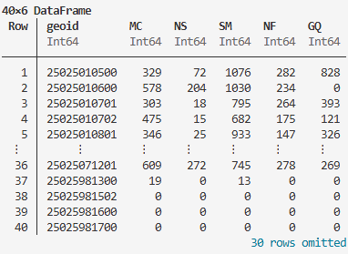

        Loops through `MARG_FILES`

        1. "tract_hhtype.csv"
        2. "tract_tenur_hhinc.csv"
        3. "tract_nwork.csv"
        4. "blkgp_tenur_hhsiz.csv"
        5. "tract_i_sex_i_age.csv"
        6. "blkgp_emply.csv"

        Note to self: If I reduce the number of `MARG_FILES` used, won't that
        reduce the number of target cells I have and thereby reduce the complexity of the LP?

        ```
        # First element of `marginals` (derived from of acs_marginals/[CENSUS_ID]/tract_hhtype.csv)
        5-element Vector{Vector{Int64}}:
        [329, 578, 303, 475, 346, 478, 606, 480, 303, 174  …  447, 413, 366, 368, 486, 609, 19, 0, 0, 0]
        [72, 204, 18, 15, 25, 109, 183, 33, 14, 27  …  76, 172, 24, 241, 262, 272, 0, 0, 0, 0]
        [1076, 1030, 795, 682, 933, 832, 1150, 1197, 664, 280  …  581, 1031, 500, 491, 1119, 745, 13, 0, 0, 0]
        [282, 234, 264, 175, 147, 306, 324, 423, 383, 179  …  633, 396, 231, 359, 415, 278, 0, 0, 0, 0]
        [828, 0, 393, 121, 326, 122, 11, 0, 84, 0  …  20, 2, 10, 0, 390, 269, 0, 0, 0, 0]
        ```
    + `levelss`

        Description: First initialised as an empty array, then later in the for-loop of lines 45 to 54, it contains all the categories of the each marginal df.

        Preview: 

        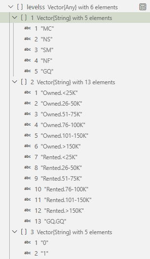

        Recall the marginal files and now you have their respective levels (categories)

        1. "tract_hhtype.csv"
        2. "tract_tenur_hhinc.csv"
        3. "tract_nwork.csv"
        4. "blkgp_tenur_hhsiz.csv"
        5. "tract_i_sex_i_age.csv"
        6. "blkgp_emply.csv"
        
    + `tract_hh_pops`

        Description: Does a row sum of `tract_hhtype` (40 x 6 dataframe). Stores it in a n-long vector, for n many tracts in the marginal dataframe.

        Example:
        ```Julia
        # Creates a vector that stores the row sums across each unique geoid row
        const tract_hh_pops = sum(marginals[1], dims=1)[1]
        ```

        `tract_hhtype.csv`

        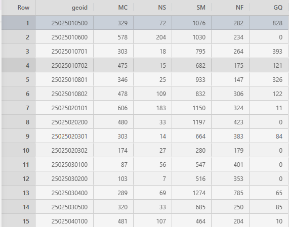

    + `blkgp_hh_pops`

        Description: A vector containing the sums across the rows of `blkgp_tenur_hhsiz` (94 x 14 dataframe), where one row represents a unique geoid.

        Example: Since there are 94 geoids in `blkgp_tenur_hhsize`, you get 94 summed values.

        `blkgp_tenur_hhsiz.csv`

        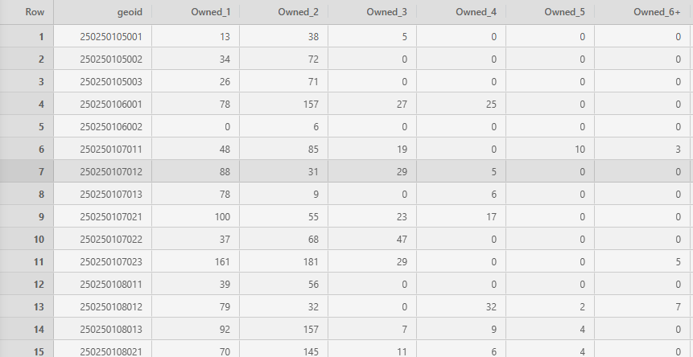

        $$\downarrow \text{: After row sum}$$

        `blkgp_hh_pops`

        <p align="center">
            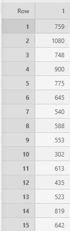
        </p>

    + `tract_indv_pops`

        Description: A vector containing the sums across the rows of `tract_i_sex_i_age` (40 x 11 dataframe), where one row represents a unique geoid.

        Example: There are a total of 40 rows (geoids) in `tract_i_sex_i_age`, so you get a vector of 40 sums across the each row.

        `tract_i_sex_i_age.csv`

        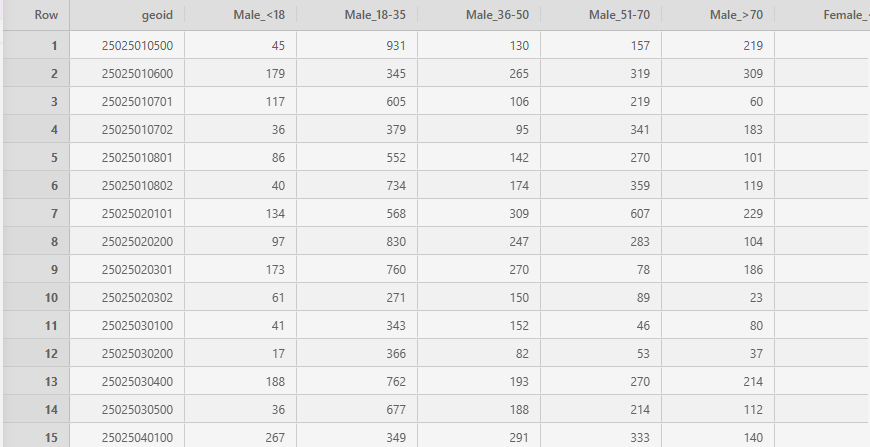


    + `blkgp_indv_pops`

        Description: A vector containing the sums across the rows of `blkgp_emply` (94 x 5 dataframe), where one row represents a unique geoid.

        `blkgp_emply.csv`

        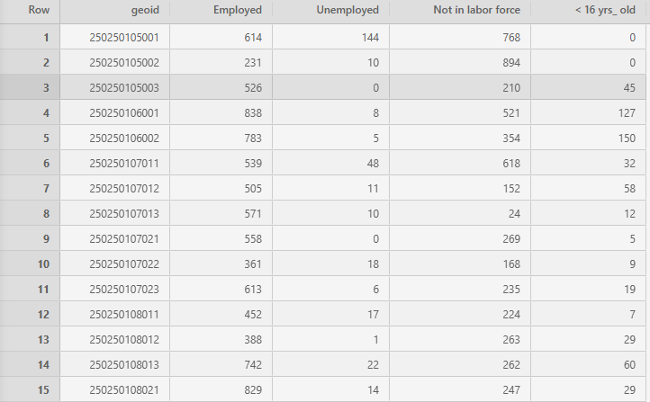

    + `syn_hhs`

        Description: Reads the synthetic household file from this directory (replace the census id with whatever was passed in the command line argument) 
        
        Example: `"synthpop_output/2503302/syn_hhs_2503302.csv"`

        

    + `puma_df`

        Description: Filters `syn_hhs` to keep only those with PUMA codes equal to `CURR_PUMA`. 

        Uses:
        + A `filter` function to turn the `puma` column values into strings, passes a conditional check that they must be 7-digits and equal to `CURR_PUMA`
            - `string(row.puma)`: Converts the numeric PUMA value from the DataFrame row into a string. If a PUMA code has a leading zero (like California's "0603700"), CSV.read often drops it and interprets it as the integer 603700.

            - `lpad(..., 7, "0")`: Pads the string with leading zeros until it is exactly 7 characters long (the standard length of a full US PUMA code including its state prefix). This restores "603700" back to its proper FIPS format: "0603700".

        ```Julia
        puma_df = filter(row -> lpad(string(row.puma), 7, "0") == CURR_PUMA, syn_hhs)
        ```

        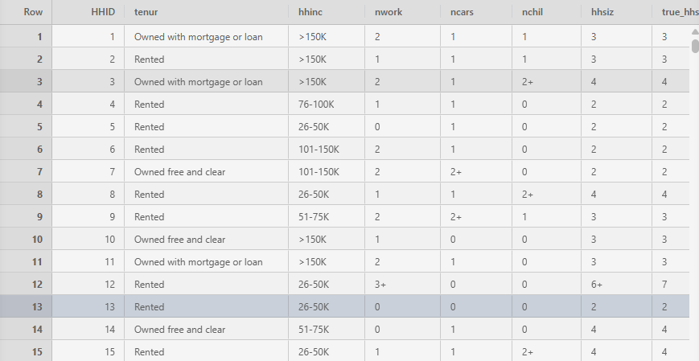

    + `pop`

        Description: Creates a 2D nested array from `puma_df`.
        
        Example: For census tract `2503302`, pop is a 61052-long vector, since the `puma_df` had size `61052 x 23`.

        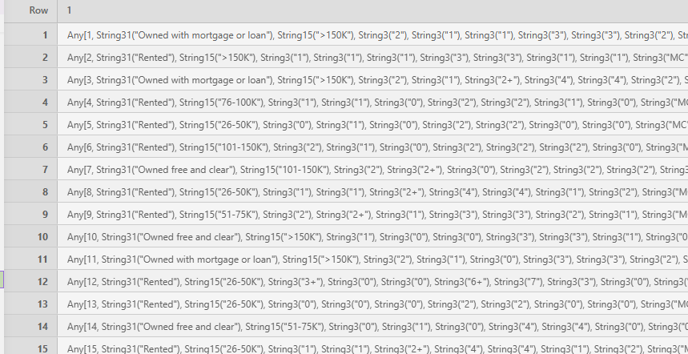

        i.e. `pop[1]` contains a 23-vector with values of every column (23 of them) for the first row.

    + `n` (Line 64: `const n = length(pop)`)

        Description: Length of `pop`.

        Example: If `pop` is a 61502-vector, the `n` is 61502.

    + `syn_indvs`

        Description: Reads the synthetic household file from this directory (replace the census id with whatever was passed in the command line argument)

        Example: `"synthpop_output/2503302/syn_indvs_2503302.csv"`

        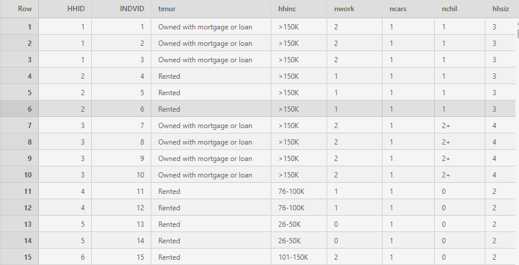

    + `n_indvs`

        Description: The number of rows in `syn_indvs`, where one row is 1 synthetic individual.

        Example: Size of `syn_indvs` for census id `2503302` is `(116963, 20)`, so `n_indvs` is `116963`.

    + `syn_hhs_hhsizs`

        Description: Run-length encoding of the household ids (`HHID`) in `syn_indvs`, see the screenshot preview of `syn_indvs`, and you'll notice that the synthetic individuals are bundled in groups of `HHIDS`.

        Brief primer on run-length encoding (RLE): 

        - Input: `rle([1,1,1,2,2,3,3,3,3,2,2,2])`

        - Output: `([1, 2, 3, 2], [3, 2, 4, 3])`

        - Output is a double, whose first element is the first number in the original array, and the second element is the length of that first number. i.e. `1` runs for length of `3` before switching to `2` which runs for length`2` and so on...


    + `indv_factors`

        Description: A nested array of 6-elements, one for every marginal data type. Within each element are the levels for that marginal, i.e. 5 levels for the first marginal data etc.

        Within each marginal level, there is a n-sized array with the count representing the number of individuals in that household that possess that marginal levels. 

        For instance:
        `indv_factors[5][1][1] #1`
        - `indv_factors[5]`: Looking at the marginal data: `tract_i_sex_i_age`
        - `indv_factors[5][1]`: Looking at the level `Male.<18` of `tract_i_sex_i_age`
        - `indv_factors[5][1][1]`: Looking at household index 1's number of `Male.<18`
        

## Line-by-line breakdown of LP

- Line 96

    ```Julia
    @variable(model, x[1:n*m]) # define variable x
    ```
     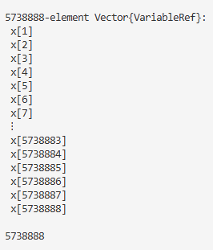
     - n: Number of households (unique household ids HHIDs), 61051
     - m: Number of blockgroups (spatial area to assign households), 94
     - Create a binary decision variable $x_{\text{HID-Blockgroup}} = 1$, this household belongs to this blockground
     - Later on (by inference from rowsum, colsum constraints): 
        + Rows: HID
        + Cols: Blockgroup

- Line 97

    ```Julia
    n_cells = sum(sum(length(lvl) for lvl in marg) for marg in marginals)
    ```

    - `n_cells`: 2918; Total sum of (marginal categories * number of rows) for every marginal dataset.
    - i.e. `marginals[1]` has 40 rows and 5 columns, then the first term in the outer-most sum is 200. `sum(length(lvl) for lvl in marginals[1])`
    - 200 + 520 + ...
    - What it means: `n_cell` represents all the possible combinations of row to categories in each marginal dataframe. i.e. Row 1 is geoid `25025010500`, and it can have 5 different target values, one target for each cateogry.

- Line 98 

    ```Julia
    @variable(model, y[1:n_cells]) # define absolute value helper variable y
    ```
    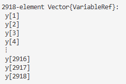

    - Create a vector with `n-cells` many decision variables `y`. 
    - `j4sonli` describes `y` as a "absolute value helper variable"
    - Remains to be seen how it will 'help'...

- Line 99-100 (blank)

- Line 101

    ```Julia
    @objective(model, Min, sum(y))
    ```
    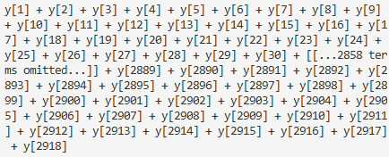

    - Sets the objective of the model as minimising the sum of `y` (All 2918 of it)
    - I suppose the sum of `y` would be the difference between the target marginal values and the actual marginal values (by geoid)

- Line 102-103 (Blank)

- Line 104

    ```Julia
    @constraint(model, con_lb[i=1:n*m], 0 <= x[i]) # lower bound constraint
    ```

    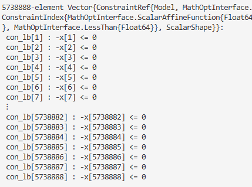

    - "A HID-Blockgroup pair cannot be negative constraint"
    - A vectorised constraint that sets the lower-bound of $x[i]$ to be greater than or equal to 0. Cannot have a negative count of a HID-Blockgroup pair. Total pairs: $n * m$.

- Line 105

    ```Julia
    @constraint(model, con_ub[i=1:n*m], x[i] <= 1) # upper bound constraint
    ```

    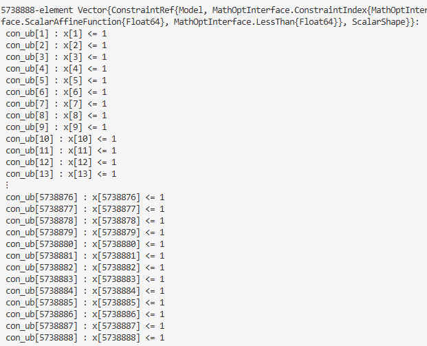

    - "Every household can only be assigned to one blockgroup constraint"
    - A vectorised constraint that sets the upperbound at 1 for each possible HID-Blockgroup pair; to prevent duplication => No unique household can be in two blockgroups at the same time. (teleport)

- Line 106

    ```Julia
    @constraint(model, con_rowsum[i=1:n], sum(x[m*(i-1)+j] for j in 1:m) == 1)
    ```

    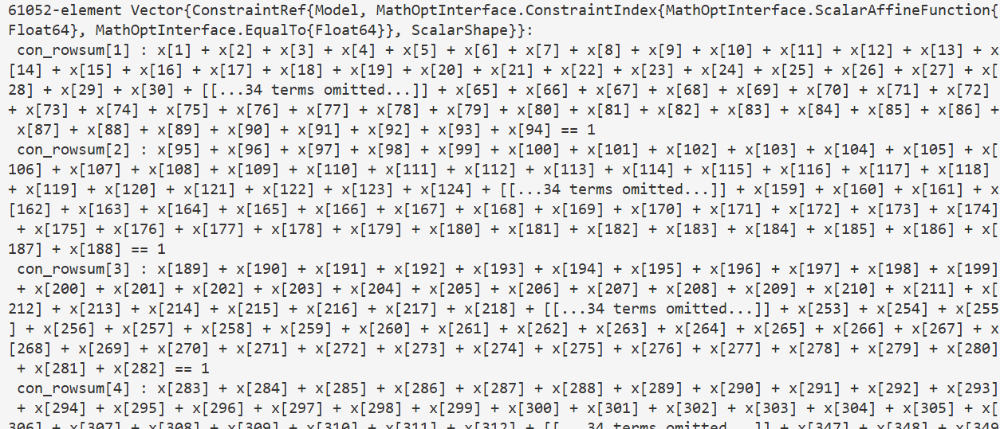

    - "Every household must be assigned to one block-group constraint"
    - Another vectorised constraint that insists that the each household is at least assigned to one blockgroup, of which there are $m=94$.

- Line 107
    ```Julia
    @constraint(model, con_colsum[j=1:m], sum(x[m*(i-1)+j] for i in 1:n) == blkgp_hh_pops[j])
    ```

    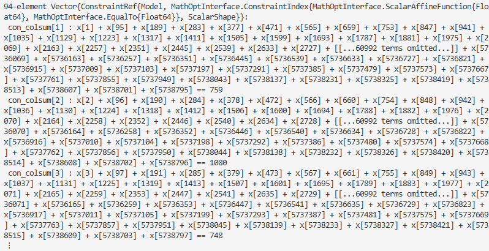

    - "The sum of households in every blockgroup must be equal to the total blockgroup household control total in `blkgp_hh_pops` constraint"
    - Recall what `blkgp_hh_pops` contains:

        

        $\implies$ Sum of all households in the blockgroup must hit the target...(no ifs, buts or maybe)
    - Note to self: Might need to relax this constraint...

- 


## Code breakdown

In the original `assign_spatial.jl` file, there are 150 lines of code.

| Lines | Summary of what it does                                                                                                                                                                 |
|:------|:----------------------------------------------------------------------------------------------------------------------------------------------------------------------------------------|
| 1-25  | <ul><li>Set random seed</li><li>Set global variables</li><ul/>                                                                                                                          |
| 26-30 | <ul><li>Sync the national census code dataframe `puma_tract_equiv` with the currently considered geodata, `current_geo`; Uses a filter function.</li><li>Set global variables</li><ul/> |
| 31-35 | Data-cleaning for `blkgp_marg_df`, i.e. Add a zero to the left to ensure the leading zero doesn't get dropped when the string value is coerced to numeric                               |
| 36-38|Assign var `tract_blkgp`: Get the row indices of `BLKGP_GEOIDS` whose first 11 chars match the current row of `TRACT_GEOIDS` => `tract_blkgp` has the same number of rows as `TRACT_GEOIDS`, and contains the index pointers to the `BLKGP_GEOIDS` rows that belong to `TRACT_GEOIDS` Bigger picture, the GEOIDS will lead you back to the marginal value (ground-truth counts of housing type)|
|39-55|<ul><li>Initialisation of variables</li><li>There is a for-loop that loops throgh `MARG_FILES` to build `marginals` (vectorised form of all the marginal dfs) and `levels` (the categories of all the marginals we're interested in)</li><ul/>|
|56-60| Assign variable for marginal target values: <ul><li>`tract_hh_pops`</li><li>`blkgp_hh_pops`</li><li>`tract_indv_pops`</li><li>`blkgp_indv_pops`</li></ul> These variables above are row-sums (across all the catorgories) of the marginal dataframes: <ul><li>`tract_hhtype.csv`</li><li>`blkgp_tenur_hhsiz.csv`</li><li>`tract_i_sex_i_age.csv`</li><li>`blkgp_indv_pops`</li></ul>|
| 61-67  | Assign variables for the synthetic HOUSEHOLDs data: <ul><li>`syn_hhs`</li><li>`puma_df`</li><li>`pop`</li><li>`n`</li></ul>|
| 68-72  | Assign variables for the synthetic INDIVIDUALS data: <ul><li>`syn_indvs`</li><li>`n_indvs`</li><li>`syn_hhs_hhsizs`</li></ul>|
|73-76|Initialise `indv_factors` array. **First for-loop**: Fills `indv_factors` with 1s, the number of 1s is the number of synthetic individuals, `n`. The number of 1-arrays is determined by the number of categories in the marginals data under consideration, i.e. levels[1] contains the cateogires of `tract_tenur_hhinc`, which has 5 categories, so there are 5 1-arrays, each 1-array of length `n`.|
|73-90| **Second for-loop**: See details of it below. Outputs `indv_factors` which is a nested array that contains 6 elements, one for every marginal dataframe, and the categories inside, and inside the categories, a n-sized array with the count of that category's value in index of the household, see `indv_factors` for details.|

```Julia
# Second for-loop lines 77-82
for (indv_marg_col, lvls) in zip(INDV_MARG_COLS, levelss[indv_index:length(levelss)])
        with_counts = combine(groupby(syn_indvs, :HHID), indv_marg_col => hh_values -> Tuple(count(val->val==l, hh_values) for l in lvls))
        counts_mat = [[v for v in vals] for vals in with_counts[!,2]]
        counts_mat = [[row[col] for row in counts_mat] for col in 1:size(counts_mat[1])[1]]
        push!(indv_factors, counts_mat)
end
```

- It groups your individual data by Household ID (:HHID).

- For each household, it iterates through every possible level (l in lvls) of that specific category and counts how many individuals inside that specific household match that level.

- If a category is Employment_Status and the levels are [Employed, Unemployed], a household with two working parents and one child might return a profile tuple like (2, 0).

Walkthrough of second loop (lines 77-82)

Iterables:

- `INDV_MARG_COLS = [19, 20]`

- `levelss[indv_index:length(levelss)]`: Refers to the last two marginal dataframes:
    - `tract_i_sex_i_age`
    - `blkgp_emply`

First iteration of second loop:

- `indv_marg_col = 19`
- `lvls = ["Male.<18", "Male.18-35", "Male.36-50", "Male.51-70", "Male.>70", "Female.<18", "Female.18-35", "Female.36-50", "Female.51-70", "Female.>70"]` which are all the categories of `tract_i_sex_i_age`, total of 10 levels in this marginal data.
- `with_counts`: Aggregates the counts for the levels. Each household (unique HHID) has a 10-array with the count of how many people in that household belong to a specific level in the `trac_i_sex_i_age` marginal.

    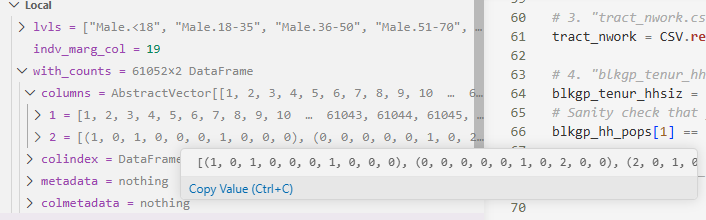

- First `counts_mat`: Converts `with_counts` into a nested array format. I guess it's takin the second column of `with_counts`.
i.e. `[(1,0,1,0,0...,0), (0,0,0,0...,0), ...,(0,0,0,0...,0)]`
- Second `counts_mat`: Transpose the `counts_mat` so that each row is the levels category of the marginal data, instead of the synthetic household. 
- Push `counts_mat` to `indv_factors`
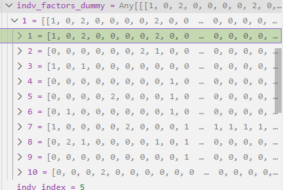

| Lines | Summary of what it does                                                                                                                                                                 |
|:------|:----------------------------------------------------------------------------------------------------------------------------------------------------------------------------------------|
|91-94| Define JuMP (Julia for Mathematical Programming) model <ul><li>`GUROBI` model, links to license file</li><li>`GUROBI_LOGFILE`</li></ul>|


marg cell for-loop logic

- Line 110 

    ```Julia
    marg_cell_i = 1
    ```

    - Initialise `marg_cell_i` as 1., index of the marginal cell for the decision variable `y` later inside the loop.

- Line 111 

    ```Julia
    for (marg_i, (marg_col, marg, lvls, indv_facs)) in enumerate(zip(vcat(MARG_COLS, INDV_MARG_COLS), marginals, levelss, indv_factors))
    ```
    |No.| Variable | Value|
    |:----|:------|:------------|
    |1|`marg_col`| `vcat(MARG_COLS, INDV_MARG_COLS)`|
    |2|`marg`| `marginals`|
    |3|`lvls`|`levelss`|
    |4|`indv_facs`|`indv_factors`|

    - `vcat(MARG_COLS, INDV_MARG_COLS)`
    - First iteration variables
        + `marg_i` = 1
        + `marg_col` = 11
        + `marg` = [[329, 578, ...]]
            i.w. first element of `marginals` 
        + `lvls` = ["MC", "NS", "SM", "NF", "GQ"]
        + `indv_facs`: Big 1s matrix, from `indv_factors`

- Line 112

    ```Julia
    cell_weight = length(lvls) * length(marg[1])
    ```

    - `length(lvls)` = 5; Number of categories in this marg data
    - `length(margs[1])` = 40; Number of geographic areas in the marg data
    - $\implies$ `cell_weight` = 200
    - `cell_weight` is use later for normalisation, so that each loop contributes to only max 1 pt of error.

- Line 113

    ```Julia
    for (lvl_i, (lvl, ifs)) in enumerate(zip(lvls, indv_facs))
    ```

    - Inner loop
    - Loops through
        + The elements in `lvls` which are the marg categories `lvl_i` in `lvls`
        + The elements in `indv_faccs` which are the count values for the many many geographic areas for that specific marginal category
    
- Line 114
    ```Julia
    if length(marg[1]) == m # block group margina
    ```

    - Within the inner-loop, check what spatial resolution this control total is depending on the number of elements in `marg[1]` the first category of marg, if it has 94 elements, the marginal data is for block-groups, otherwise it is for censust tracts.

- Line 120-121

    ```Julia
    else # tract marginal
        for j in 1:length(tract_hh_pops)
    ```

    - Else-inner-loop
    - Iterable: The total number census tracts, i.e. the length of `tract_hh_pops` <- contains the control totals for each tract
    - In other words, each iteration of this loop is looking at each unique tract.

- Line 122

    ```Julia
    @constraint(model, y[marg_cell_i] >= (sum(sum(ifs[i] * x[m*(i-1)+k] for k in tract_blkgp[j]) for (i,hh) in enumerate(pop) if marg_i>=indv_index || hh[marg_col]==lvl) - marg[lvl_i][j])/(1+marg[lvl_i][j])/cell_weight*tract_hh_pops[j])
    ```

    - For each unique tract, add a constraint that constrains the `marg_cell_i`th `y` decision variable to 
    - Recall that `marg_cell_i` is the index of 2918; Total sum of (marginal categories * number of rows (geographic area)) for every marginal dataset.
    - RHS of inequality: 
        $$ \frac{\sum_j (\sum_i a_{ij} - b_j)}{c}$$

        + $\sum_{j} a_{ij}$: `(sum(ifs[i] * x[m*(i-1)+k] for k in tract_blkgp[j]) for (i,hh) in enumerate(pop) if marg_i>=indv_index || hh[marg_col]==lvl)`; This is the estimate number of poeple/households with the specific marg category in tract `j`,
        + $b_j$: `marg[lvl_i][j])`: The actual census total, subtracted from the estimated number

        + $c$: `(1+marg[lvl_i][j])/cell_weight*tract_hh_pops[j]`; The normalisation and scaling factor

    - Julia MP expression of $a_{i1} - b_1$:

        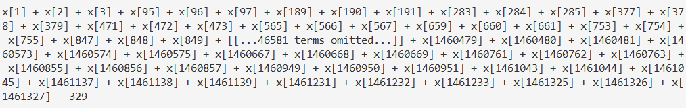


## Possible Sources of Error
- Line 37: Gurobi may need every single tract to have at least one block group nested inside it to avoid an algebraic error (like dividing by zero), may want to drop any empty tracts from your list before feeding this array to JuMP.


## Model

### Decision Variables

$n$: Total population 

```Julia
const n = length(pop) # 61052
```

$m$: Total number of geoids (lowest spatial resolution, one level below census tract id)

```Julia
const m = length(BLKGP_GEOIDS) # 94
```

<table>
  <tr>
    <th>Julia</th>
    <th>Mathematical Expression</th>
  </tr>
  <tr>
    <td>

```Julia
@variable(model, x[1:n*m]) # define variable x
# For census tract 2503302, that's a 61052 x 94 matrix
```
</td>
    <td>

$$\forall \, j, \, d, \, 0 \leq X_{j, d} \leq 1$$
</td>
  </tr>
  <tr>
    <td>

```Julia
# n_cells: The sum of categories for all marginals 
n_cells = sum(sum(length(lvl) for lvl in marg) for marg in marginals)
@variable(model, y[1:n_cells]) # define absolute value helper variable y
```
</td>
    <td>


</td>
  </tr>
</table>


```Julia
@variable(model, x[1:n*m]) # define variable x
n_cells = sum(sum(length(lvl) for lvl in marg) for marg in marginals)
@variable(model, y[1:n_cells]) # define absolute value helper variable y
```


```Julia

## Objective
@objective(model, Min, sum(y))

## Constraints
@constraint(model, con_lb[i=1:n*m], 0 <= x[i]) # lower bound constraint
@constraint(model, con_ub[i=1:n*m], x[i] <= 1) # upper bound constraint
@constraint(model, con_rowsum[i=1:n], sum(x[m*(i-1)+j] for j in 1:m) == 1)
@constraint(model, con_colsum[j=1:m], sum(x[m*(i-1)+j] for i in 1:n) == blkgp_hh_pops[j])

# add marginal cell constraints to enforce absolute value
marg_cell_i = 1
for (marg_i, (marg_col, marg, lvls, indv_facs)) in enumerate(zip(vcat(MARG_COLS, INDV_MARG_COLS), marginals, levelss, indv_factors))
        cell_weight = length(lvls) * length(marg[1])
        for (lvl_i, (lvl, ifs)) in enumerate(zip(lvls, indv_facs))
                if length(marg[1]) == m # block group marginal
                        for j in 1:m
                                @constraint(model, y[marg_cell_i] >= (sum(ifs[i] * x[m*(i-1)+j] for (i,hh) in enumerate(pop) if marg_i>=indv_index || hh[marg_col]==lvl) - marg[lvl_i][j])/(1+marg[lvl_i][j])/cell_weight*blkgp_hh_pops[j])
                                @constraint(model, y[marg_cell_i] >= -(sum(ifs[i] * x[m*(i-1)+j] for (i,hh) in enumerate(pop) if marg_i>=indv_index || hh[marg_col]==lvl) - marg[lvl_i][j])/(1+marg[lvl_i][j])/cell_weight*blkgp_hh_pops[j])
                                global marg_cell_i += 1
                        end
                else # tract marginal
                        for j in 1:length(tract_hh_pops)
                                @constraint(model, y[marg_cell_i] >= (sum(sum(ifs[i] * x[m*(i-1)+k] for k in tract_blkgp[j]) for (i,hh) in enumerate(pop) if marg_i>=indv_index || hh[marg_col]==lvl) - marg[lvl_i][j])/(1+marg[lvl_i][j])/cell_weight*tract_hh_pops[j])
                                @constraint(model, y[marg_cell_i] >= -(sum(sum(ifs[i] * x[m*(i-1)+k] for k in tract_blkgp[j]) for (i,hh) in enumerate(pop) if marg_i>=indv_index || hh[marg_col]==lvl) - marg[lvl_i][j])/(1+marg[lvl_i][j])/cell_weight*tract_hh_pops[j])
                                global marg_cell_i += 1
                        end
                end
        end
end

## Optimize
status=optimize!(model)
```


# LaTeX For Google Slides

$N = \{n | n = [i, j, \ldots, k]\} \text{    } \text{for } n \in N$ 

$i, j, \ldots k \in \text{neighbourhood}(n)$

$$\sum_{i=1}^{n}\frac{\sum_{j=1}^{n}w_{ij}(x_j - \bar{x})}{(x_i - \bar{x})} = \frac{\sum_{j=1}^{n}w_{1j}(x_j - \bar{x})}{(x_1 - \bar{x})} + \frac{\sum_{j=1}^{n}w_{2j}(x_j - \bar{x})}{(x_2 - \bar{x})} + \ldots + \frac{\sum_{j=1}^{n}w_{nj}(x_j - \bar{x})}{(x_n - \bar{x})}$$


$$n$$

$$\sum^n_{i=1} \sum^m_{j=1}x_{ij} = \sum^n_{i=1} 1 = n$$

$$\sum^m_{j=1} \sum^n_{i=1}x_{ij} = \sum^m_{j=1} \text{blkgp\_hh\_pops[j]}$$

$$\implies \text{blkgp\_hh\_pops[j]} = n$$

