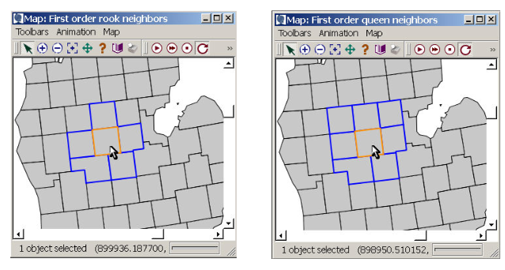

```{r}
knitr::opts_chunk$set(echo = TRUE, message = FALSE, warning = FALSE)
```

# Introduction

My attempt to understand and reproduce the work done in the synthpop repo by j4sonli.

TODO: Look into infeasible model message. 
https://support.gurobi.com/hc/en-us/articles/360029969391-How-do-I-determine-why-my-model-is-infeasible

# Set up Environment

^ Only need to run once
```{r}
# 1. Initialise a renv in the project directory, you can check 
# it's created in your local machine by running `.libPaths()`
# renv::init()

# 2. Install the packages j4sonli recommended in his README
# renv::install(c(c("dplyr","tidyr","stringr","R.utils","tidycensus","bnlearn","foreach","doSNOW","ggplot2")))

# 3. Update your lockfile
# renv::snapshot()
```

# Load Libraries
```{r}
library(glue)
library(dplyr)
library(ggplot2)
```


```{r}
# Test getting api key from config file
# Install if necessary: install.packages("config")
cfg <- config::get()
us_census_api_key <- cfg$us_census_api_key
```


```{r}
STATE_FIPS <- data.frame(
  state_name = c(
    "Alabama", "Alaska", "Arizona", "Arkansas", "California", "Colorado", 
    "Connecticut", "Delaware", "District of Columbia", "Florida", "Georgia", 
    "Hawaii", "Idaho", "Illinois", "Indiana", "Iowa", "Kansas", "Kentucky", 
    "Louisiana", "Maine", "Maryland", "Massachusetts", "Michigan", "Minnesota", 
    "Mississippi", "Missouri", "Montana", "Nebraska", "Nevada", "New Hampshire", 
    "New Jersey", "New Mexico", "New York", "North Carolina", "North Dakota", 
    "Ohio", "Oklahoma", "Oregon", "Pennsylvania", "Rhode Island", "South Carolina", 
    "South Dakota", "Tennessee", "Texas", "Utah", "Vermont", "Virginia", 
    "Washington", "West Virginia", "Wisconsin", "Wyoming"
  ),
  state_abb = c(
    "AL", "AK", "AZ", "AR", "CA", "CO", "CT", "DE", "DC", "FL", "GA", 
    "HI", "ID", "IL", "IN", "IA", "KS", "KY", "LA", "ME", "MD", "MA", 
    "MI", "MN", "MS", "MO", "MT", "NE", "NV", "NH", "NJ", "NM", "NY", 
    "NC", "ND", "OH", "OK", "OR", "PA", "RI", "SC", "SD", "TN", "TX", 
    "UT", "VT", "VA", "WA", "WV", "WI", "WY"
  ),
  state_code = c(
    "01", "02", "04", "05", "06", "08", "09", "10", "11", "12", "13", 
    "15", "16", "17", "18", "19", "20", "21", "22", "23", "24", "25", 
    "26", "27", "28", "29", "30", "31", "32", "33", "34", "35", "36", 
    "37", "38", "39", "40", "41", "42", "44", "45", "46", "47", "48", 
    "49", "50", "51", "53", "54", "55", "56"
  ),
  stringsAsFactors = FALSE
)

head(STATE_FIPS)
```


# Cambridge Massachusetts
Sample synth pop dataset in repo

```{r}
output_cambridge_hhs <- read.csv("./synthpop_output/2503302/syn_hhs_spatial_2503302-example.csv")

head(output_cambridge_hhs)
```


# Fulton County, Georgia

```{r include=FALSE}
# Subset to Georgia
STATE_NAME <- "Georgia"
COUNTY_FP <- 121 # Fulton county, where Georgia Tech is
puma_df <- read.csv("synthpop_data/2010_Census_Tract_to_2010_PUMA.csv")
GA_STATE_CODE <- STATE_FIPS[STATE_FIPS$state_name == STATE_NAME,]$state_code

GA_puma_df <- puma_df[puma_df$STATEFP == GA_STATE_CODE,]
GA_puma_codes <- (GA_puma_df %>%
  group_by(STATEFP, PUMA5CE) %>%
  summarise(count = n()))$PUMA5CE

# Print unique puma codes in GA, to run the synthpop script later
unique(GA_puma_codes)
```


```{r}
# Federal Information Processing Standard (Federal Information Processing Standard), two-digit numeric ids for US states
PUMA_CODE <- GA_puma_codes[1]
GA_STATE_CODE <- STATE_FIPS[STATE_FIPS$state_name == STATE_NAME,]$state_code
run_command <- glue('Rscript synthpop.R -puma={GA_STATE_CODE}00{PUMA_CODE}')

# Run the following command in your terminal to generate a synthpop of Fulton County, where Atlanta is a part of
print(run_command)
```
## Output

```{r}
# Where Atlanta is located
output_fulton_hhs <- read.csv("./synthpop_output/1300100/syn_hhs_1300100.csv")
head(output_fulton_hhs, 5)
```

##  Comparison (Cambridge v. Fulton)

```{r}
# Intersect columns from 
intersected_colnames <- intersect(colnames(output_cambridge_hhs), colnames(output_fulton_hhs))

for (colnames in intersected_colnames) {
  print(colnames)
}
```


```{r include=FALSE}
# Run line by line to see the unique output
unique(output_cambridge_hhs$tenur)
unique(output_cambridge_hhs$HHID)
unique(output_cambridge_hhs$tenur)
unique(output_cambridge_hhs$hhinc)
unique(output_cambridge_hhs$nwork)
unique(output_cambridge_hhs$ncars)
unique(output_cambridge_hhs$nchil)
unique(output_cambridge_hhs$hhsiz)
unique(output_cambridge_hhs$true_hhsiz)
unique(output_cambridge_hhs$true_nwork)
unique(output_cambridge_hhs$true_nchil)
unique(output_cambridge_hhs$hhtype)
unique(output_cambridge_hhs$puma)
unique(output_cambridge_hhs$i_age)
unique(output_cambridge_hhs$i_sex)
unique(output_cambridge_hhs$race_)
unique(output_cambridge_hhs$i_eth)
unique(output_cambridge_hhs$i_inc)
unique(output_cambridge_hhs$emply)
unique(output_cambridge_hhs$indus)
unique(output_cambridge_hhs$edu_q)
unique(output_cambridge_hhs$tenur_prox)
```

# Maps

##  Create directories

to store census information. Only run if you don't have the expected data directories.
```{r}
# base_path <- "synthpop_data/acs_marginals"
# 
# org_map_pumas <- c("0603701", "0603716", "0603733",
#                "4805000", "4804901", "4804614",
#                "0400134", "0400105", "0400122",
#                "2501400", "2503603", "2503302",
#                "1208900", "1203105", "1203103",
#                "5600200", "5600100", "5600300", "5600400", "5600500")
# 
# 
# for (map_puma in org_map_pumas) {
#   # Dynamically construct the path: "synthpop_data/acs_marginals/0603701"
#   full_puma_dir <- file.path(base_path, map_puma)
#   
#   if (!dir.exists(full_puma_dir)) {
#     dir.create(full_puma_dir, recursive = TRUE, showWarnings = FALSE)
#     cat("Initialized folder:", full_puma_dir, "\n")
#   }
# }
```

## Download Census Data For Demo
Only run again if you don't have the data yet.
```{r}
# org_map_pumas <- c("0603701", "0603716", "0603733",
#                "4805000", "4804901", "4804614",
#                "0400134", "0400105", "0400122",
#                "2501400", "2503603", "2503302",
#                "1208900", "1203105", "1203103",
#                "5600200", "5600100", "5600300", "5600400", "5600500")
# for (org_puma in org_map_pumas) {
#   command <- glue('Rscript synthpop_truncated.R -puma={org_puma}')
#   print(command)
# }
```


## Import `plot_maps`

```{r}
box::use(./plot_maps)
```


List of functions in plot_maps


* [X] plot_study_areas()
* [X] plot_tract_hhtype_diffs_map()
* [X] plot_error_map()
* [X] plot_error_heatmaps()
* [ ] plot_pie()
* [X / Helper] error_heatmap()
* [Helper] rmse()
* [Helper] get_rmses()
* [Helper] process_marginals()
* [Helper] get_error_map_data()

## Constants
```{r}
map_pumas <- c("0603701", "0603716", "0603733",
               "4805000", "4804901", "4804614",
               "0400134", "0400105", "0400122",
               "2501400", "2503603", "2503302",
               "1208900", "1203105", "1203103",
               "5600200", "5600100", "5600300", "5600400", "5600500")

densities <- c(383.7, 9049.6, 42788.1,
               66.1, 3457.2, 11736.8,
               112.0, 3947.0, 8075.6,
               885.9, 5817.3, 28710.4,
               160.5, 1989.8, 3285.1,
               # last entry is density for entire state of WY
               5.97)
synpop_suffix <- "20220127"
```

# Trial Plot Functions

```{r}
# 1. plot_study_areas()
box::reload(plot_maps)
plot_maps$plot_study_areas(map_pumas, save_pdf=FALSE)
```

```{r}
# 2. plot_error_heatmap()
box::reload(plot_maps)
heatmap <- plot_maps$plot_error_heatmaps(syn_hhs_spatial_file="synthpop_output/2503302/syn_hhs_spatial_2503302-example.csv",
                          syn_indvs_spatial_file="synthpop_output/2503302/syn_indvs_spatial_2503302-example.csv",
                          marg_dir="synthpop_data/acs_marginals/2503302/", save_pdf=TRUE)
```

```{r}
# 3. plot_error_map
map_pumas_subset <- c(2503302)
box::reload(plot_maps)
plot_maps$plot_error_map("Spatial errors in tenure by houshold income distribution",
               map_pumas_subset, densities,
               variable="tenur_hhinc",
               spatial_level="tract",
               synpop_suffix=synpop_suffix,
               gray_hh_pop_under=30,
               gray_indv_pop_under=50,
               NA_label="too few households",
               save_pdf=FALSE)
#synthpop/synthpop_output/2503302/syn_hhs_spatial_2503302.csv
```
```{r}
map_pumas
```


```{r}
# 4. plot_tract_hhtype_diffs_map()
box::reload(plot_maps)
# map_pumas_subset <- c(2503302)
plot_maps$plot_tract_hhtype_diffs_map("Tract-level deviation of household type composition from PUMA mean", map_pumas, densities, save_pdf=TRUE)
```


# tmap fixes

## tmap
```{r}
# .libPaths()
# # Re-install the v3 branch directly to renv environment
# renv::purge("tmap")
# renv::install("r-tmap/tmap@v3")
# 
# # Snapshot the environment state to update your renv.lock file
# renv::snapshot(prompt = FALSE)
# packageVersion("tmaptools")
```

## tmaptools
```{r}
# # 1. Wipe the current mismatched tmaptools
# renv::purge("tmaptools")
# 
# # 2. Install the legacy version of tmaptools that matches tmap v3
# # Version 3.1-1 is the stable companion release for tmap v3
# renv::install("cran/tmaptools@3.1-1")
# 
# # 3. Reinstall tmap@v3 just to ensure dependencies hook back together cleanly
# renv::install("r-tmap/tmap@v3", upgrade = "never")
# 
# # 4. Lock this working combination into your renv lockfile
# renv::snapshot(prompt = FALSE)
```


# Moran's I
```{r}
# Reference: https://mgimond.github.io/simple_moransI_example/
library(sf) # Simple features: For manipulating vector spatial data in R
library(spdep) # Provides the Moran's I functuions; spdep: Spatial dependence
library(tmap)
```


## Load Data
```{r}
# Load the shapefile, from .rds (R's ver of a Python pickle file)
s <- readRDS(url("https://github.com/mgimond/Data/raw/gh-pages/Exercises/nhme.rds"))
```

```{r}
# Save `s` to shapefile format
st_write(s, "morans_i/data/nhme.shp")
```

```{r}
# Load `nhme` data from local file
s_local <- st_read("morans_i/data/nhme.shp")
s_local
```

```{r}
names(s_local)
```

## EDA

Moran's I is becomes less useful if there are outliers / if the data is heavily skewed. 
So it's good practice to check for the distribution of the data at the start.

- Histogram
- Boxplot

```{r}
# Histogram
hist(s$Income, main=NULL)

# Boxplot
boxplot(s$Income, horizontal=FALSE)
```

The boxplot shows one dot as an outlier. Gimond's tutorial
accepts this and doesn't change the data moving forward.

## Creating the map

```{r}
tm_shape(s) + tm_fill(col="Income", style="quantile", n=8, palette="Greens") +
              tm_legend(outside=TRUE)
```

## Moran's I Analysis

### Step 1
- Define neighbouring polygons
- 'Neigbouring' could mean
  + Contiguous polygons (polygons adjacent to one another, no gaps)
  + Polygons within a certain distance threshold
  + Non-spatial definition, i.e. social, political, cultural neighbours.
- In the next step, the Gimond adopts a 'contiguous' definition, accepting polygons that share at least one vertex
- Polygon adjacency definitions (Resource: https://www.biomedware.com/files/documentation/spacestat/Data_Preparation/adj/Polygon_contiguities.htm)
  + Queen case: If your polygon's vertex touches my (current position's) polygon, we're neighbours
  + Rook case: Your polygon needs to share a border (not just vertex) with my (current position's) polygon, to be defined as neighbours.
  

```{r}
nb <- poly2nb(s, queen=TRUE)
# The polygon ids that are 'neighbours' of polygon id 1
# In this case, each polygon is one county
typeof(nb)
```

### Step 2
- Assign weights to the neighbours
- Gimond assigns equal weight to each neighbouring polygon's mean income values
```{r}
# lw stands for list weights
# lw object has the following attributes
# - style
# - neighbours
# - weights
lw <- nb2listw(nb, style="W", zero.policy=TRUE)
lw$style
lw$neighbours[1] # list of neighbours for index 1
lw$weights[1] # list of weights for index 1
```

- On neighbour weights: If a polygon has 5 neighbours, each neighbour will have a weight of 1/5 or 0.2.
- The weight will be used to compute the mean neighbour values as in

```
0.2(neighbor1) + 0.2(neighbor2) + 0.2(neighbor3) + 0.2(neighbor4) + 0.2(neighbor5)
```

### Step 3 (Optional)
- Computed the (weighted) neighbour mean income values
- Note from Gimond: 
  > NOTE: This step does not need to be performed when running the moran or moran.test functions outlined in Steps 4 and 5. This step is only needed if you wish to generate a scatter plot between the income values and their lagged counterpart.

```{r}
# Compute the average neighbour income value for each polygon
# Spatially lagged values: Weighted average or sum of a 
# variable's value across neighbouring locations
# ^ account for geographic dependencies
inc.lag <- lag.listw(lw, s$Income)
inc.lag
```

- Plot least squares regression
- The plot compares a row's (polygon's) mean income with the spatially average income of its neighbours as defined in the weights matrix
```{r}
plot(inc.lag ~ s$Income, pch=16, asp=1)
M1 <- lm(inc.lag ~ s$Income)
abline(M1, col="blue")
```

- The slope of the line in the ordinary-least-squares model is Moran's I coefficient
```{r}
coef(M1)[2]
```

### Step 4
- Computing the Moran's I statistic
```{r}
I <- moran(s$Income, lw, length(nb), Szero(lw))[1]
```
- Gibbon: "Recall that the Moran’s I value is the slope of the line that best fits the relationship between neighboring income values and each polygon’s income in the dataset."

```{r}
# print(s$Income)
# print(length(lw))
# print(length(nb))
# print(length(Szero(lw)))
# print(I)
```

### Step 5
- Performing a hypothesis test
- $H_0$ : “the income values are randomly distributed across counties following a completely random process”
- $H_1$ : "There is a spatial element to the distribution of mean income in the counties"
- Two methods to perform hypothesis test
  + Analytical method
  + Monte Carlo method

1. Analytical method
- Use the `moran.test` function; one-sided hypothesis test.
- Recall that the motivations for one vs. two sided test
  + One-sided: An increase or decrease (single directional change)
  + Two-sided: A change in either direction (bidirectional change)
```{r}
moran.test(s$Income,lw, alternative="greater")
```
- ^ Output log states that the p-value is close to 0.
- Documentation for `moran.test`
```R
moran.test(x, listw, randomisation=TRUE, zero.policy=attr(listw, "zero.policy"),
           alternative="greater", rank = FALSE, na.action=na.fail, spChk=NULL,
           adjust.n=TRUE, drop.EI2=FALSE)
```
- The `alternative` parameter can take the following arguments
  + `greater`, $\mu > x$
  + `less`, $\mu < x$
  + `two.sided` $\mu \neq x$

```{r}
# First arg: Attribute you want to test for
# Second arg: List of weights
# Alternative: greater, lesser, two.sided hypothesis test
moran.test(s$Income, lw, alternative="two.sided")
```

- Recall that p-value is the probablity of observing a more extreme test statistic (favouring $H_1$).
- See YSC3249 Notes, Lecture 9
- TODO: Look into normality assumption, and use of the `randomisation` parameter in the package

```{r}
# spdep, hyp test doc: https://r-spatial.github.io/spdep/reference/moran.test.html
# data(oldcol)
# coords.OLD <- cbind(COL.OLD$X, COL.OLD$Y)
# nb2listw(COL.nb, style="W")
# COL.nb
# lw
# lw <- nb2listw(nb, style="W", zero.policy=TRUE) # replace COL.nb with lw?
```

2. Monte Carlo Method
- Analytical approach to Moran's I may be sensitive to irregularly distributed polygons.
- Use the `moran.mc(n)` function to run an MC simulation, where `n` is the number of simulations.
```{r}
MC<- moran.mc(s$Income, lw, nsim=999, alternative="greater")

# View results (including p-value)
MC
```

```{r}
# Plot the Null distribution (note that this is a density plot instead of a histogram)
# ^ to help visualise the distribution of Moran's I values had
# incomes been randomly distributed.
# The black line shows our observed statistic falls way right of the
# distribution => income values are clustered
plot(MC)
```

Gimond suggests another way to visualise (on a map) how a typical your patterns are
is to compare randomly distributed patterns side-by-side from your observed spatial distribution
of your demographic attribute (or whatever attribute you're interested in)

```{r}
set.seed(131)
s$rand1 <- sample(s$Income, length(s$Income), replace = FALSE)
s$rand2 <- sample(s$Income, length(s$Income), replace = FALSE)
s$rand3 <- sample(s$Income, length(s$Income), replace = FALSE)

tm_shape(s) + tm_fill(col=c("Income", "rand1", "rand2", "rand3"),
                      style="quantile", n=8, palette="Greens", legend.show = FALSE) +
              tm_facets( nrow=1)
```

Left-most: Observed plot
Right-three-plots: Randomly distributed plots

## Moran's I, Example 2

- Full work flow given below
- Uses Monte Carlo approach to determine if homicide rates are spatially correlated
```{r}
set.seed(2354)
# Load the shapefile
s_florida <- readRDS(url("https://github.com/mgimond/Data/raw/gh-pages/Exercises/fl_hr80.rds"))

# Save file
# st_write(s_florida, "morans_i/data/florida.shp")

# Define the neighbors (use queen case)
nb <- poly2nb(s_florida, queen=TRUE)

# Compute the neighboring average homicide rates
lw <- nb2listw(nb, style="W", zero.policy=TRUE)

# Run the MC simulation version of the Moran's_florida I test
M1 <- moran.mc(s_florida$HR80, lw, nsim=9999, alternative="greater")

# Plot the results
plot(M1)

# Display the resulting statistics
M1
```

- Plotting the map
```{r}
names(s_florida)
```

```{r}
tm_shape(s_florida) + 
  tm_fill(col="HR80", style="quantile", n=8, palette="Reds") +
  tm_legend(outside=TRUE)
```

## Moran's I (`synpop`)

```{r}
library(sf)
library(spdep) 
library(tmap)
```

```{r}
sf_geos.puma.sf <- readRDS("rds_data/sf_geos.puma.sf.rds")
head(sf_geos.puma.sf)
```

### EDA
- TODO...Do I need to do anything to resolve the outlier??

```{r}
# Histogram
MAIN <- "RMSE (Census v. SynPop); Suffolk County, MA"
HIST_X_LAB <- "RMSE"
hist(sf_geos.puma.sf$rmse, main=MAIN, xlab=HIST_X_LAB)

# Boxplot
BOXPLOT_Y_LAB <- "RMSE"
BOXPLOT_X_LAB <- "Suffolk County, MA"
boxplot(sf_geos.puma.sf$rmse, horizontal=FALSE, main=MAIN, ylab=BOXPLOT_Y_LAB, xlab=BOXPLOT_X_LAB)
```


### Define Neighbours

- All variables will have the `_sp` suffix, which stands for `synthpop`

```{r}
library(tidyr)
sf_geos.puma.sf_noNAs <- sf_geos.puma.sf %>%
                          drop_na()
print(length(sf_geos.puma.sf_noNAs$rmse))
print(length(sf_geos.puma.sf$rmse))
```


```{r}
# Create neighbour list
nb_sp <- poly2nb(sf_geos.puma.sf, queen=TRUE)
nb_sp #48 census plots

nb_sp_noNAs <- poly2nb(sf_geos.puma.sf_noNAs, queen=TRUE)
```

```{r}
# Create lw (list weights) object
# TODO: Read documentation to understand what each param controls
# https://r-spatial.github.io/spdep/reference/nb2listw.html
lw_sp <- nb2listw(nb_sp, style="W", zero.policy=TRUE)
lw_sp

lw_sp_noNAs <- nb2listw(nb_sp_noNAs, style="W", zero.policy=TRUE)
```

### Compute Moran's I statistic

```{r}
# I_sp <- moran(sf_geos.puma.sf$rmse, lw_sp, length(nb_sp), Szero(lw_sp))
# print(sf_geos.puma.sf$rmse)
# I_sp

I_sp_noNAs <- moran(sf_geos.puma.sf_noNAs$rmse, lw_sp_noNAs, length(nb_sp_noNAs), Szero(lw_sp_noNAs))
I_sp_noNAs$I #0.19, so there's not much clustering of the rmses?
# K: sample kurtosis of x, a measure of how heavy tailed.
# For reference the normal distribution has a kurtosis of 3
# https://r-spatial.github.io/spdep/reference/moran.html
I_sp_noNAs$K
```


```{r}
sf_geos.puma.sf_noNAs$rmse
# Hypothesis test
moran.test(sf_geos.puma.sf_noNAs$rmse, lw_sp_noNAs, alternative="two.sided")

# Calculate Moran's I for gaussian-sampled RMSE
set.seed(42)
sf_geos.puma.sf_noNAs$rand1 <- sample(sf_geos.puma.sf_noNAs$rmse, length(sf_geos.puma.sf_noNAs$rmse), replace = FALSE)
sf_geos.puma.sf_noNAs$rand2 <- sample(sf_geos.puma.sf_noNAs$rmse, length(sf_geos.puma.sf_noNAs$rmse), replace = FALSE)
sf_geos.puma.sf_noNAs$rand3 <- sample(sf_geos.puma.sf_noNAs$rmse, length(sf_geos.puma.sf_noNAs$rmse), replace = FALSE)

sf_geos.puma.sf_noNAs$rand3[0:10]
sf_geos.puma.sf_noNAs$rmse[0:10]
head(sf_geos.puma.sf_noNAs)
```

```{r}
sf_geos.puma.sf_noNAs[["rmse"]]
```

```{r}
for (i in 1:10) {
  print(i)
}
```

```{r}
length(nb_sp_noNAs)
length(lw_sp_noNAs)
```

```{r}
# Running monte carlo simulations, shuffling the rmse values across the different regions
shuffle_rmse <- function(df, target_col, n_perm, lw, nb) {
  target_array <- df[[target_col]]
  Is <- c()
  for (i in 1:n_perm)  {
    sampled_array <- sample(target_array, length(target_array), replace = FALSE)
    # print(sampled_array)
    sampled_I <- moran(sampled_array, lw, length(nb), Szero(lw))$I
    # Push new values into the stack
    Is <- c(Is, sampled_I)
  }
  return (Is)
}
```

```{r}
set.seed(42)
gaussian_Is_99 <- shuffle_rmse(sf_geos.puma.sf_noNAs, "rmse", 99, lw_sp_noNAs, nb_sp_noNAs)
gaussian_Is_99_df <- data.frame(I=gaussian_Is_99)
gaussian_Is_99_df


# hist(gaussian_Is_99, main="Gaussian Distributed Moran's I of RMSE Values", xlab="Moran's I", vline=I_sp_noNAs$I)
ggplot(gaussian_Is_99_df, aes(x = I)) +
  geom_histogram() +
  # geom_vline(data=xintercept=I_sp_noNAs$I, colour="red")
  #data = vlines,aes(xintercept = xint,colour = grp <- follow this format for plotting

```

### Plot Map

```{r}
names(sf_geos.puma.sf_noNAs)
```


```{r}
# Run again if you want to recreate random values
# set.seed(42)
# sf_geos.puma.sf_noNAs$rand1 <- sample(sf_geos.puma.sf_noNAs$rmse, length(sf_geos.puma.sf_noNAs$rmse), replace = FALSE)
# sf_geos.puma.sf_noNAs$rand2 <- sample(sf_geos.puma.sf_noNAs$rmse, length(sf_geos.puma.sf_noNAs$rmse), replace = FALSE)
# sf_geos.puma.sf_noNAs$rand3 <- sample(sf_geos.puma.sf_noNAs$rmse, length(sf_geos.puma.sf_noNAs$rmse), replace = FALSE)

# sf_geos.puma.sf_noNAs$rand3[0:10]
# sf_geos.puma.sf_noNAs$rmse[0:10]
```

```{r}
# tm_shape(sf_geos.puma.sf_noNAs) + 
#   tm_fill(col=c("rmse", "rand1", "rand2", "rand3"),
#           style="quantile", n=8, palette="Greens", legend.show=TRUE) +
#   tm_facets(nrow=1)
library(tmap)

# 1. Set tmap to plot mode
tmap_mode("plot")

map_plot <- tm_shape(sf_geos.puma.sf_noNAs) + 
  # Use a named vector for 'col' to instantly create clean subtitles for each map
  tm_fill(col = c("RMSE Analysis" = "rmse", 
                  "Random Simulation 1" = "rand1", 
                  "Random Simulation 2" = "rand2", 
                  "Random Simulation 3" = "rand3"),
          style = "quantile", 
          n = 8, 
          palette = "Greens", 
          legend.show = TRUE) +
  # Keep them side-by-side on one row
  tm_facets(nrow = 1) +
  # Fix the legend position and scale to prevent overlaps
  tm_layout(
    legend.outside = TRUE,          # Forces the legend completely off the map panels
    legend.outside.position = "right", # Places it cleanly on the right side
    panel.show = TRUE,              # Ensures panel borders/headers are distinct
    panel.labels = c("Synpop v. Marginals (RMSE)", "Control A", "Control B", "Control C"), # Alternative way to force clean subtitles
    inner.margins = c(0.05, 0.05, 0.05, 0.05), # Adds a buffer inside the panels so shapes don't hit the edges
    asp = NA
  )

tmap_save(map_plot, 
          filename = "plots/rmse_v_gaussian.pdf", 
          width = 16,   # Width in inches (gives the 4 maps room to spread out)
          height = 5)   # Height in inches
```

```{r}
map_plot <- tm_shape(sf_geos.puma.sf_noNAs) + 
  # 1. Keep 'col' as a clean vector. This keeps your legend data consistent.
  tm_fill(col = c("rmse", "rand1", "rand2", "rand3"),
          style = "quantile", 
          n = 8, 
          palette = "Greens", 
          legend.show = TRUE) +
  # 2. Force tmap to combine them into one single legend block on the right
  tm_facets(nrow = 1, free.scales = FALSE) +
  # 3. Clean up the structural layout
  tm_layout(
    # Set the overarching title header for the single, unified legend block
    legend.title.size = 1.2,
    title="RMSE",
    # Legend breakout parameters
    legend.outside = TRUE,          
    legend.outside.position = "right", 
    
    # Facet panel titles (these will sit elegantly right above each of your 4 maps)
    panel.show = TRUE,              
    panel.labels = c("Synpop v. Marginals (RMSE)", "Control A", "Control B", "Control C"), 
    
    inner.margins = c(0.02, 0.02, 0.02, 0.02), 
    asp = 0 # Removess map compression/white bars in horizontal layout
  )
map_plot
# Save high-res vector file
tmap_save(map_plot, filename = "plots/map_plot_2.pdf", width = 16, height = 5)
```